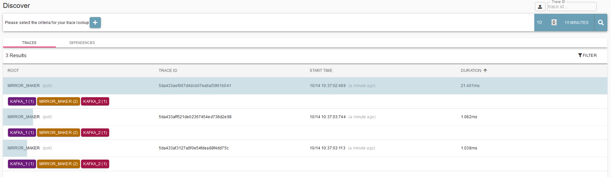
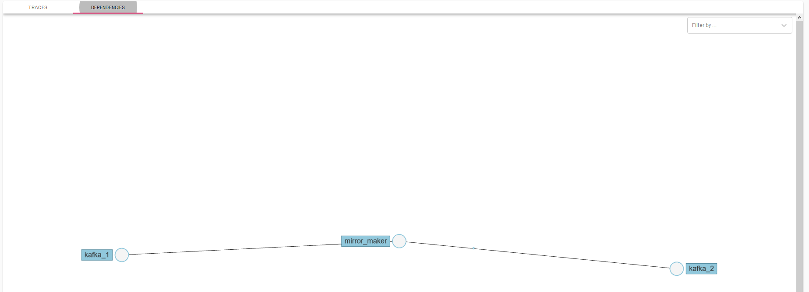
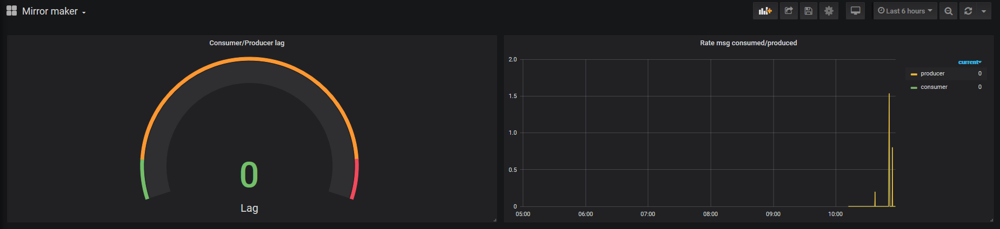

# Kafka Mirror Maker operations

Instrumentation of Kafka Mirror Maker to collect metrics and traces.

## How to use

Start environment:

```bash
docker-compose up -d
```

Create topics:

```bash
make kafka-topics
```

Use kafkacat to produce/consume messages:

```bash
$ kafkacat -b localhost:29092 -P -t t1
a
b
c
# exit
$ kafkacat -b localhost:29092 -C -t t1
a
c
b
% Reached end of topic t1 [1] at offset 1
% Reached end of topic t1 [0] at offset 2
```

Result:







## Grafana

Metrics:

Consumed/Produced lag:

```promql
sum(kafka_consumer_consumer_fetch_manager_metrics_records_consumed_total{job="mirror-maker", topic="t1"}) - sum(kafka_producer_producer_metrics_record_send_total{job="mirror-maker"})
```

Rate consumed/produced:

```promql
#Consumed
rate(kafka_consumer_consumer_fetch_manager_metrics_records_consumed_total{job="mirror-maker", topic="t1"}[$__interval])
#Produced
rate(kafka_producer_producer_metrics_record_send_total{job="mirror-maker"}[$__interval])
```
